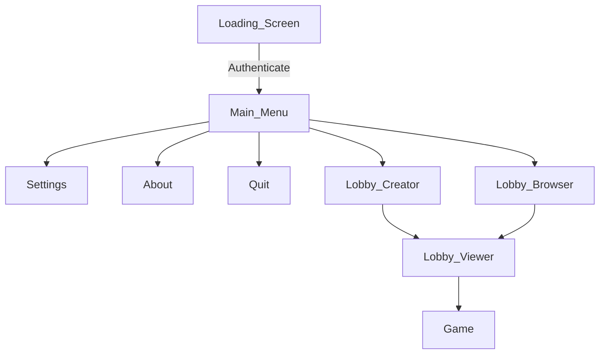

# Blazium Shared Menus

Shared menus used for settings, lobby management and game starting.

## Project Settings

After enabling this addon, you need to set the following in `Project Settings` (Some have default values, some don't):

| Setting Key | Description | Default Value |
|-|-|-|
| blazium/game/max_players_min | Minimum players needed to start a game. | 2 |
| blazium/game/max_players_max | Maximum players needed to start a game. | 10 |
| blazium/game/max_players_default | Default players set when creating a lobby. | 6 |
| blazium/game/lobby_server_local | Use local Lobby Server. | false |
| blazium/game/store_name | Set in actions to store name. | "" |
| blazium/game/pogr_client_id | Your pogr client id. Used for analytics. | "" |
| blazium/game/pogr_build_id | Your pogr build id. Used for analytics. | "" |
| blazium/game/login_game_id | Your login game_id. Used for authentication. | "" |
| blazium/game/lobby_game_id | Your lobby game_id. Used for multiplayer. | "" |

The lobby and login `game_id`'s are required. The pogr id's are only for analytics.

## Menus

All scenes are located in their own folder. The Game scene is not in this repo but instead it's loaded from `res://game/game.tscn`. This will be the screen of your game.

Also the following scene has to exist: `res://game/menu_persona.tscn`. This will be used in the main menu.

## Design

Each of the scenes are designed to be resizeable. This is done by having the following structure:

- Control
	- BlaziumBG (animated interactable background)
		- HBoxContainer
			- LeftSpacer
			- VBoxContainer: Child of this is the content.
			- RightSpacer

The idea is that the left and right spacer will help distribute the spacing evenly (based on `stretch_ratio` set). These will dissapear on portrait mode (mobile screens).

Then, inside the content, there will be:

- Label: Title
- BoxContainer

The BoxContainer is set to either be VBox or HBox based on screen orientation.
